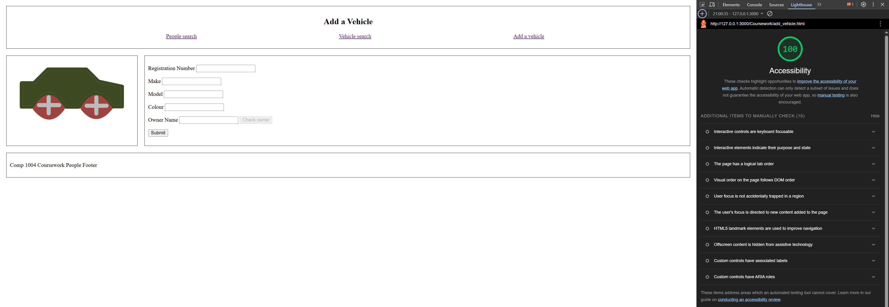
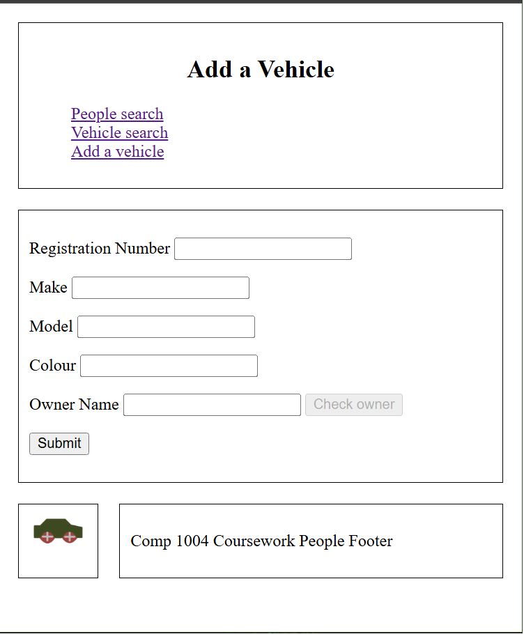

# HTML Accessibility

Changes made to [add_vehicle.html](add_vehicle.html) to achieve 100 accessibility are as follows:

- Added `<li></li>` tags to each element in the unordered list in navigation bar on lines 22,23,24
[Lines 22-24 of add_vehicle.html](add_vehicle.html#L22-L24)

- Added `<label></label>` tags to each input element on lines 31-35 inclusive
[Lines 31-45 of add_vehicle.html](add_vehicle.html#L32-L35)

# CSS Responsive Layout

Changes made to [vehicle.css](vehicle.css) to achieve responsive layout when width is less than 500px are located on lines 67 onwards.

[Lines 65-95 of vehicle.css](vehicle.css#L65-L95)
